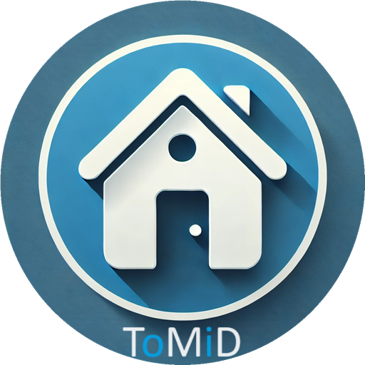

# ToMiD Accommodations

## Description

ToMiD Accommodations is a platform to facilitate the rental of apartments, rooms, houses and other temporary places to stay. The dashboard display makes it easy to find affordable and well reviewed options. Additionally, users are able to add their own advertisments for a place they are looking to rent out.

The project is made with React.

## Functionalities

- Users are able to view all available rentals on the dashboard page.
- Well priced and well reviewed items are marked by a label.
- Users can click on any item to view more details on the specific item.
- Users are able to mark any item to add it to their list of favorites.
- Users can easily 'unfavorite' any favorite item to remove it from the favorites tab.
- Uers can delete any item from the dashboard.
- Users can edit any item.
- Users can add a new item to the dashboard.
- Users can easily navigate between the 'home', 'about' and 'favorites' pages.

## Technologies

- JavaScript
- HTML
- CSS
- React
- Vite

## Links

[Github repository](https://github.com/tdot123-1/mini-project-react-app/tree/main)